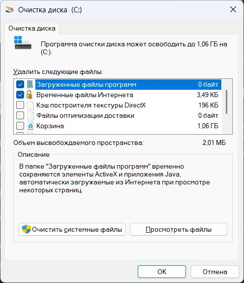
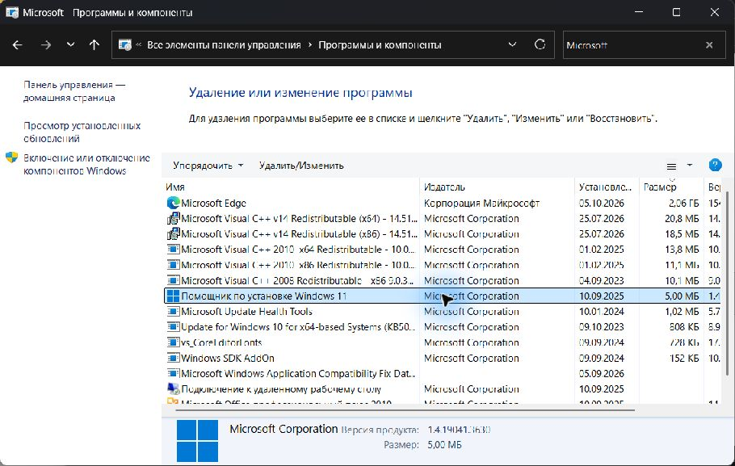
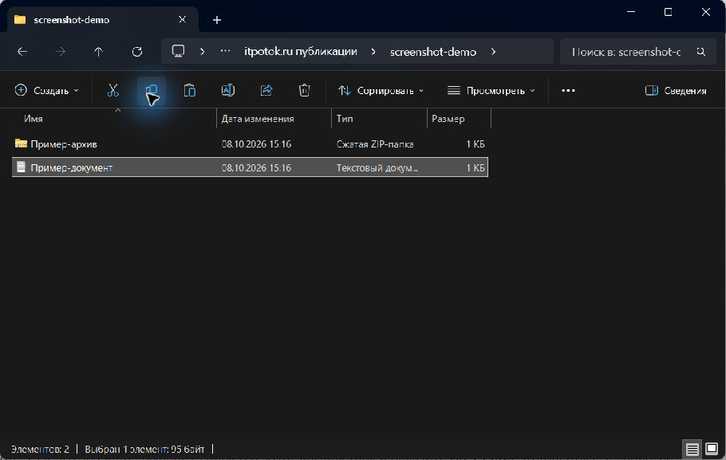
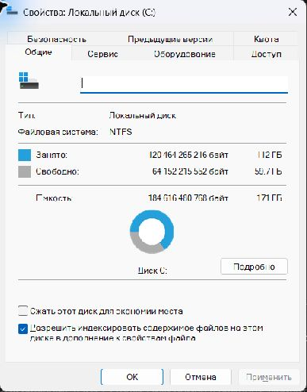

# Как почистить диск C в Windows 11

Начните с временных файлов в «Параметрах» или встроенной «Очистке диска». Если места недостаточно, удалите ненужные приложения или перенесите крупные файлы на другой накопитель.

Перед уборкой откройте «Проводник» → «Этот компьютер» и запишите свободное место на C. Сохраните нужные файлы из «Загрузок» и корзины: после удаления средствами очистки вернуть их обычным восстановлением из корзины не получится.

## Удалить временные файлы

1. Нажмите **Win + I** и откройте **«Система» → «Память» → «Временные файлы»**. В некоторых переводах раздел называется «Хранилище».
2. Дождитесь расчёта, прочитайте описания и отметьте ненужные категории. Диагностические файлы оставьте, если разбираетесь с ошибкой.
3. Проверьте флажки у **«Загрузок»** и **«Корзины»**: там могут быть ваши документы. **«Предыдущие установки Windows»** пока оставьте — условия удаления разобраны ниже.
4. Нажмите **«Удалить файлы»** и дождитесь завершения. Если потребуется перезагрузка, сначала сохраните открытые документы.

В разделе «Память» можно также открыть **«Рекомендации по очистке»**. Проверяйте предложенные файлы перед удалением: рекомендация не означает, что они вам не нужны.

## Использовать «Очистку диска»

Если удобнее отдельное окно со списком категорий:

1. Нажмите **Win + R**, введите `cleanmgr` и нажмите Enter.
2. Если появится выбор диска, укажите **C:** и дождитесь анализа.
3. Нажимайте на категории, читайте описание внизу окна и отмечайте ненужные данные.
4. Для дополнительных категорий нажмите **«Очистить системные файлы»**. При запросе подтвердите права администратора, снова выберите C и дождитесь расчёта.
5. Проверьте флажки, нажмите **«ОК»** и подтвердите удаление. До подтверждения можно выйти кнопкой «Отмена».

Собственный снимок Windows 11. Used with permission from Microsoft. Показанные 1,06 ГБ — оценка перед удалением на одном ПК.

**«Загруженные файлы программ» — не папка «Загрузки».** Ориентируйтесь на описание категории.

## Если очистки недостаточно

### Удалить ненужные программы и игры

Откройте «Параметры» → «Приложения» → «Установленные приложения», выберите диск C и сортировку по размеру, если она доступна. Сохраните проекты, игровые сохранения и сведения о лицензии. У ненужной программы выберите «…» → «Удалить» и завершите мастер. Если её нельзя удалить здесь, проверьте «Панель управления» → «Программы и компоненты». Переустановка программы не гарантирует возврат её данных — нужна копия или синхронизация.

Кнопка «Удалить/Изменить» в «Программах и компонентах». Список отфильтрован по Microsoft; служебные пакеты Visual C++ без необходимости не удаляйте. Used with permission from Microsoft.

### Перенести личные файлы

Просмотрите «Загрузки», «Видео», «Документы» и рабочий стол. Выделите крупные файлы и нажмите **Ctrl + C**. Откройте папку на другом накопителе и нажмите **Ctrl + V**. Проверьте, что копии открываются, затем удалите оригиналы с C. Проверьте корзину перед её очисткой. Перемещение в другую папку на C не освобождает место; вернуть файлы можно копированием обратно.

Демонстрационный пример: выбран документ, указатель на кнопке копирования. Для освобождения места на C копируйте на другой накопитель. Used with permission from Microsoft.

### Освободить место с помощью OneDrive

Если его папка находится на C, а файлы синхронизированы, при включённых «Файлах по запросу» нажмите правой кнопкой → «Освободить место». Облачный файл останется; для открытия понадобится интернет. Чтобы вернуть локальную копию, выберите «Всегда хранить на этом устройстве» и дождитесь загрузки. Обычное «Удалить» затрагивает и файл в облаке.
### Удалить предыдущую установку Windows

Если возврат к прежней Windows не нужен, проверьте работу новой системы и сохраните нужные файлы старого профиля. Затем в «Временных файлах» или «Рекомендациях по очистке» выберите «Предыдущие установки Windows», если пункт есть, и запустите очистку с правами администратора. **Отменить удаление и вернуть возможность штатного отката нельзя.**

## Настроить регулярную уборку

Откройте **«Параметры» → «Система» → «Память» → «Контроль памяти»**. Включите функцию, выберите частоту запуска и срок хранения в корзине. Для «Загрузок» оставьте **«Никогда»**, если не готовы удалять их автоматически. Проверьте правила облачного содержимого: файлы «только в сети» требуют интернета.

После проверки правил можно нажать **«Запустить Контроль памяти сейчас»**. Убедитесь, что настройки сохранились. Чтобы остановить будущую уборку, выключите функцию; удалённые файлы это не восстановит.

## Проверить результат

Обновите сведения о C в «Этот компьютер» и сравните свободное место с исходным значением. Оценки разных средств могут учитывать одни и те же файлы — не складывайте их. Кэш создаётся заново; если место быстро исчезает, проверьте растущую категорию в разделе «Память» и данные приложений.

Для точного значения выделите диск C в «Этот компьютер» и нажмите **Alt + Enter**: откроются его свойства.

Собственный снимок Windows 11. Used with permission from Microsoft. Значения показывают состояние одного ПК, а не результат выполненной очистки.

**Не удаляйте вручную системные папки, весь AppData, `hiberfil.sys` и `pagefile.sys`.** Установленные программы удаляйте штатным способом. Если почти всё место занимают нужные данные, потребуется другой накопитель или увеличение хранилища.

Способы и ограничения описаны в справках Microsoft: <a href="https://support.microsoft.com/ru-ru/windows/experience/storage-filemanagement/free-up-drive-space-in-windows" rel="nofollow">освобождение места</a>, <a href="https://learn.microsoft.com/en-us/windows-server/administration/windows-commands/cleanmgr" rel="nofollow">cleanmgr</a>, <a href="https://support.microsoft.com/ru-ru/windows/experience/storage-filemanagement/manage-drive-space-with-storage-sense" rel="nofollow">контроль памяти</a>, <a href="https://support.microsoft.com/ru-ru/windows/deployment/install-upgrade/delete-your-previous-version-of-windows" rel="nofollow">предыдущая установка Windows</a>, <a href="https://support.microsoft.com/ru-ru/onedrive/save-disk-space-with-onedrive-files-on-demand-for-windows" rel="nofollow">файлы OneDrive по запросу</a>.
